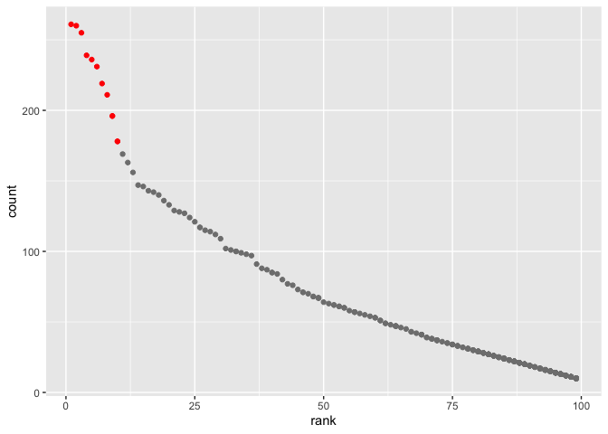

p8105\_hw2\_ym2771
================
Yuqi Miao
9/24/2019

# Problem 1

## Read and clean the Mr. Trash Wheel sheet:

``` r
library(tidyverse)
library(readxl)
```

``` r
Mr_trash_wheel <- 
    read_excel('data/Trash-Wheel-Collection-Totals-8-6-19.xlsx', sheet = 1, range = "A2:N408") %>% 
    janitor::clean_names() %>%
    drop_na() %>% 
    mutate(sports_balls = as.integer(round(sports_balls, digits = 0)))

    
## omit rows that do not include dumpster-specific data     
  
## round the number of sports balls to the nearest integer and converts the result to an integer variable?    
```

### Data description:

This dataset has 344 observations and 14varaibles, and giving
information on the dumpter number(dumpster), date of collection(month,
year, date), amount of total litter(weight\_tons, volume\_cubic\_yards),
litter type(volume\_cubic\_yards, plastic\_bottles, polystyrene,
cigarette\_butts, glass\_bottles, grocery\_bags, chip\_bags,
sports\_balls) and efficiency of generating power(homes\_powered).

## Read and clean precipitation data for 2017 and 2018

``` r
precip_2017 <- 
    read_excel("data/Trash-Wheel-Collection-Totals-8-6-19.xlsx", sheet = 6, range = "A2:B14") %>% 
    mutate(Year = 2017) %>% 
    select(Year, everything()) %>% 
    drop_na()
    
precip_2018 <- 
    read_excel("data/Trash-Wheel-Collection-Totals-8-6-19.xlsx", sheet = 5, range = "A2:B14") %>% 
    mutate(Year = 2018) %>% 
    select(Year, everything()) %>% 
    drop_na()
```

## Next, combine precipitation datasets and convert month to a character variable

``` r
precip_data <- 
    rbind(precip_2017,precip_2018) %>% 
    mutate(Month = month.name[Month])
```

This dataset contains 24 observations and 3 variables, giving
information on monthly total precipitation (key variable name: Total) in
2017-2018.

  - The total precipitation in 2018 is 70.33

  - The median number of sports balls in a dumpster in 2017 is 8

# Problem 2

## First, clean the data in pols-month.csv.

``` r
pols_month <- 
    read_csv("data/fivethirtyeight_datasets/pols-month.csv") %>% 
    separate(col = mon, into = c("year","month","day"), sep = "-") %>%
    mutate(year = as.numeric(year),month = as.numeric(month)) %>% 
    arrange(year, month) %>% 
    mutate(month = month.name[month]) %>%
    pivot_longer(cols = c(prez_gop, prez_dem),names_to = "president", names_prefix = "prez_",values_to = "value") %>% 
    filter(value != 0) %>% 
    select(-value,-day)
```

    ## Parsed with column specification:
    ## cols(
    ##   mon = col_date(format = ""),
    ##   prez_gop = col_double(),
    ##   gov_gop = col_double(),
    ##   sen_gop = col_double(),
    ##   rep_gop = col_double(),
    ##   prez_dem = col_double(),
    ##   gov_dem = col_double(),
    ##   sen_dem = col_double(),
    ##   rep_dem = col_double()
    ## )

### discussion:

In variable prez\_gop, there exists 5 abnormal values: 2, which is not
defined in the data description. In this data manipulation, I regard
observations with 2 in prez\_gop as the president was republican on the
associated date since the corresponding value in var prez\_dem suggests
the president was not democratic.

## Second, clean the data in snp.csv

``` r
snp <- read_csv("data/fivethirtyeight_datasets/snp.csv") %>%
    separate(col = date, into = c("month","day","year"), sep = "/") %>%
    mutate(year = as.numeric(year),month = as.numeric(month)) %>% 
    arrange(year, month) %>% 
    mutate(month = month.name[month]) %>%
    select(year, month, everything(), -day)
```

    ## Parsed with column specification:
    ## cols(
    ##   date = col_character(),
    ##   close = col_double()
    ## )

## Third, tidy the unemployment data

``` r
unemployment <- 
    read_csv("data/fivethirtyeight_datasets/unemployment.csv") %>%
    mutate(year = Year) %>%
    pivot_longer(cols = Jan:Dec, names_to = "month", values_to = "unemployment_rate") %>%
    mutate(year = as.numeric(year), month = match(month, month.abb)) %>% 
    arrange(year,month) %>% 
    mutate(month = month.name[month]) %>%
    select(year, month, everything(),-Year)
```

    ## Parsed with column specification:
    ## cols(
    ##   Year = col_double(),
    ##   Jan = col_double(),
    ##   Feb = col_double(),
    ##   Mar = col_double(),
    ##   Apr = col_double(),
    ##   May = col_double(),
    ##   Jun = col_double(),
    ##   Jul = col_double(),
    ##   Aug = col_double(),
    ##   Sep = col_double(),
    ##   Oct = col_double(),
    ##   Nov = col_double(),
    ##   Dec = col_double()
    ## )

## Finally, merging data

``` r
FiveThirtyEight <- 
    left_join(pols_month, snp)
```

    ## Joining, by = c("year", "month")

``` r
FiveThirtyEight <- 
    left_join(FiveThirtyEight, unemployment) 
```

    ## Joining, by = c("year", "month")

  - The first data frame “pols\_month” is the basic data frame with 822
    rows \* 9 columns, the range of year is from 1947 to 2015, and the
    names of the key variables are gov\_gop, sen\_gop, rep\_gop,
    gov\_dem, sen\_dem, rep\_dem, president

  - The second data frame “snp” has the dimension of 787 rows \* 3
    columns, the range of year is from 1950 to 2015, and the names of
    the key variables is close.

  - The third data frame “unemployment” has 816 rows \* 3 columns, the
    range of year is from 1948 to 2015, and the names of the key
    variables is unemployment\_rate.

  - By merging snp and unemployment data into pols\_month, we have the
    final dataset, FiveThirtyEight, with 822 rows \* 11 columns, the
    range of year is from 1947 to 2015, for the range of the year in
    different set is different, some values are missing. The name of key
    variables are the combination of above, including gov\_gop,
    sen\_gop, rep\_gop, gov\_dem, sen\_dem, rep\_dem, president, close,
    unemployment\_rate .

# Problem 3

## Load and tidy the data.

``` r
pop_bb_name <- 
    read_csv("data/Popular_Baby_Names.csv") %>% 
    janitor::clean_names() %>% 
    mutate(ethnicity = recode(ethnicity,`ASIAN AND PACIFIC ISLANDER` = "ASIAN AND PACI", `BLACK NON HISPANIC` = "BLACK NON HISP", `WHITE NON HISPANIC` = "WHITE NON HISP")) %>%
    mutate(childs_first_name = str_to_title(childs_first_name)) %>% 
    distinct()
```

    ## Parsed with column specification:
    ## cols(
    ##   `Year of Birth` = col_double(),
    ##   Gender = col_character(),
    ##   Ethnicity = col_character(),
    ##   `Child's First Name` = col_character(),
    ##   Count = col_double(),
    ##   Rank = col_double()
    ## )

Produce a table showing the rank in popularity of the name “Olivia”

``` r
Olivia <-
    pop_bb_name %>% 
    filter(gender == "FEMALE" & childs_first_name == "Olivia") %>%
    pivot_wider(names_from = year_of_birth, values_from = rank,id_cols = ethnicity)

knitr::kable(x = Olivia, caption = " Table 1: The rank the name “Olivia” as a female baby name over time" )    
```

| ethnicity      | 2016 | 2015 | 2014 | 2013 | 2012 | 2011 |
| :------------- | ---: | ---: | ---: | ---: | ---: | ---: |
| ASIAN AND PACI |    1 |    1 |    1 |    3 |    3 |    4 |
| BLACK NON HISP |    8 |    4 |    8 |    6 |    8 |   10 |
| HISPANIC       |   13 |   16 |   16 |   22 |   22 |   18 |
| WHITE NON HISP |    1 |    1 |    1 |    1 |    4 |    2 |

Table 1: The rank the name “Olivia” as a female baby name over
time

## Produce a similar table showing the most popular name among male children over time.

``` r
most_pop_male_name <- 
  pop_bb_name %>% 
  filter(gender == "MALE") %>%
  group_by(ethnicity, year_of_birth) %>%
  summarise(name = childs_first_name[match(max(count), count)]) %>%
  pivot_wider(names_from = year_of_birth, values_from = name, id_cols = ethnicity)
knitr::kable(x = most_pop_male_name, caption = "Table 2: The most popular male name of male baby name over time" )    
```

| ethnicity      | 2011    | 2012   | 2013   | 2014   | 2015   | 2016   |
| :------------- | :------ | :----- | :----- | :----- | :----- | :----- |
| ASIAN AND PACI | Ethan   | Ryan   | Jayden | Jayden | Jayden | Ethan  |
| BLACK NON HISP | Jayden  | Jayden | Ethan  | Ethan  | Noah   | Noah   |
| HISPANIC       | Jayden  | Jayden | Jayden | Liam   | Liam   | Liam   |
| WHITE NON HISP | Michael | Joseph | David  | Joseph | David  | Joseph |

Table 2: The most popular male name of male baby name over time

## plotting

``` r
plot_data <- 
    pop_bb_name %>% 
    filter(year_of_birth == "2016" & ethnicity == "WHITE NON HISP" & gender == "MALE")
  

g <- ggplot(data = plot_data, aes(x= rank, y = count, label = childs_first_name)) +
    geom_point(color = ifelse(plot_data$rank > 10, "grey50","red")) 
g
```

<!-- -->
